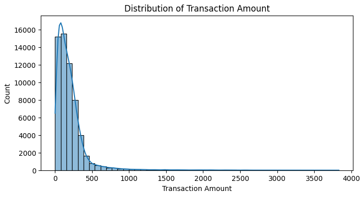

# 💳 Credit Card Fraud Detection with Machine Learning

## 📌 Project Overview

This project applies machine learning techniques to detect fraudulent credit card transactions using a highly imbalanced financial dataset.

The analysis focuses on identifying fraudulent activity while minimizing false negatives through data preprocessing, exploratory data analysis, class imbalance handling, feature scaling, model training, and performance evaluation.

Several supervised learning models were evaluated and compared using precision, recall, F1-score, ROC-AUC, and Area Under the Precision-Recall Curve (AUCPR) metrics.

---

## 🎯 Project Objectives

The primary objectives of this project were to:

- Detect fraudulent credit card transactions using machine learning
- Address class imbalance within fraud detection data
- Compare classification model performance
- Evaluate fraud detection effectiveness using precision-recall metrics
- Optimize model performance through hyperparameter tuning
- Select the best-performing fraud detection model

---

## 🛠️ Technologies Used

- Python
- Pandas
- NumPy
- Matplotlib
- Seaborn
- Scikit-learn
- Jupyter Notebook

---

## 📊 Project Workflow

### 1. Data Cleaning & Preprocessing
- Removed unnecessary identifiers
- Checked for missing values and duplicates
- Applied feature scaling
- Prepared target labels for classification

### 2. Exploratory Data Analysis (EDA)
- Fraud vs non-fraud distribution analysis

- 
- 
- Transaction amount analysis
- Feature correlation analysis
- Class imbalance visualization

### 3. Machine Learning Modeling
The following models were trained and evaluated:

- Logistic Regression
- Decision Tree Classifier
- Random Forest Classifier

### 4. Model Evaluation
Models were evaluated using:

- Accuracy
- Precision
- Recall
- F1-Score
- ROC-AUC
- AUCPR (Area Under Precision-Recall Curve)

### 5. Hyperparameter Tuning
- Random Forest optimization
- Cross-validation
- Performance comparison

---

## 🔬 Key Machine Learning Concepts

| Concept | Purpose |
|---|---|
| Classification | Detect fraudulent transactions |
| Class Imbalance Handling | Improve fraud detection reliability |
| Precision & Recall | Evaluate fraud detection effectiveness |
| Random Forest | Improve predictive performance |
| Hyperparameter Tuning | Optimize model performance |

---

## 📈 Key Findings

- Fraudulent transactions represented a small minority of the dataset, creating a significant class imbalance challenge.
- Random Forest models outperformed simpler classification models in fraud detection performance.
- Precision-recall metrics provided more meaningful evaluation than accuracy alone due to the imbalanced dataset.
- Hyperparameter tuning improved model stability and predictive capability.
- AUCPR proved to be an effective metric for evaluating fraud detection quality.

---

## 📊 Sample Visualizations

### Fraud vs Non-Fraud Distribution


### Feature Correlation Heatmap


### Model Performance Comparison


---

## 📁 Repository Structure

```text
credit-card-fraud-detection/
│
├── README.md
├── index.html
├── James_Grolig_Project_2_Credit_Card_Fraud.ipynb
├── requirements.txt
└── images/
```

---

## 🚀 Future Improvements

Future enhancements for this project may include:

- Deep learning fraud detection models
- Real-time fraud monitoring systems
- Advanced anomaly detection methods
- Ensemble learning optimization
- Cost-sensitive learning techniques
- Deployment as an interactive web application

---

## 👤 Author

**Jake Grolig**  
Applied AI Student | Machine Learning | Data Science | Python Development
